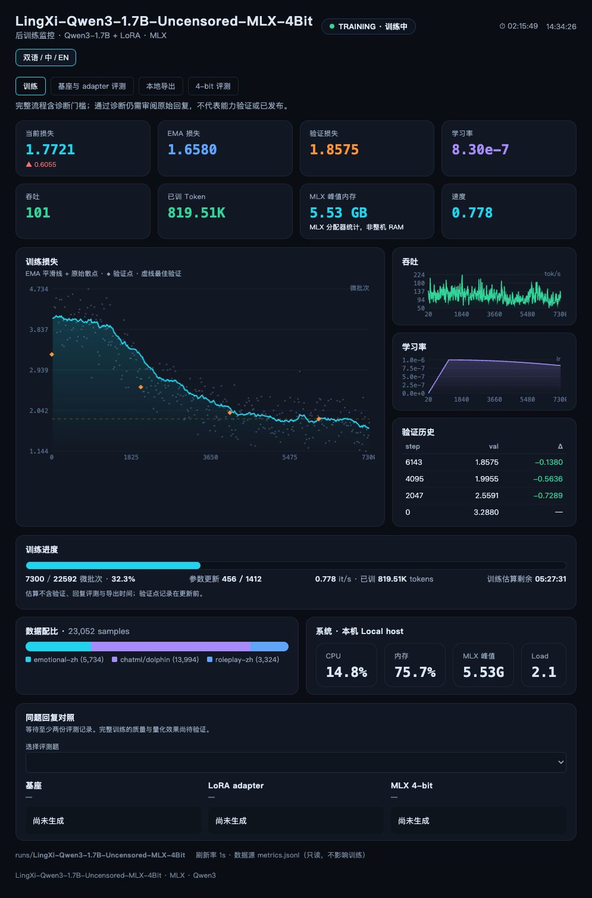

# LingXi-Qwen3-1.7B-Uncensored-MLX-4Bit

**在 Apple Silicon 上复现一次完整的中文大模型微调。**

A reproducible Qwen3-1.7B fine-tuning recipe for Apple Silicon: Chinese roleplay and emotional dialogue,
MLX LoRA training, live monitoring, matched reply checks, and local 4-bit export.

灵犀围绕这一个模型，提供从 Qwen 对话格式到训练、评测和导出的完整流程。
`Uncensored` 是目标定位；拒答变化与通用能力分别验证。
训练使用 BF16 基座，名称中的 `4Bit` 指最终 MLX 量化产物。
已实现 SFT、拒答探针与 A/B 偏好收集；DPO、GRPO 尚未实现。

| 项目状态 | 证据范围 |
| --- | --- |
| Apple Silicon 运行 | Mac mini · M4 · 16 GB，整轮训练已完成，约6小时43分钟 |
| 参数实验 | 九组候选；记录配置、原始回复与失败案例 |
| 软件回归 | 临时微型模型的训练、续载、实际量化导出与看板页面 |
| 最终 adapter 质量 | 34组匹配对照的助手审阅，尚未通过质量验收 |
| 4-bit 效果 / 权重发布 | 尚未导出与发布 |

[快速试跑](#快速试跑) · [完整训练](#完整训练) · [实验结果](docs/RESULTS.md) · [质量审阅](docs/QUALITY.md) · [方法与上游依据](docs/METHOD.md) · [参与贡献](#参与贡献)



截图为 2026-10-09 的训练中状态；实时进度与回复对照以本地看板为准。

## 快速试跑

需要 Apple Silicon Mac 和 Python 3.13。先检查可用内存、磁盘和后台任务；
此路径只下载基座，使用仓库内 12 条训练、4 条验证的原创小样本。
样本按 Apache-2.0 提供，采用 Qwen 非思考格式，来源和固定划分见 [stats.json](docs/smoke/stats.json)。
它检查软件流程，不用于判断风格、泛化或模型能力。首次模型下载时间另计，试跑耗时尚未实测。

```bash
git clone https://github.com/YuanyuanMa03/lingxi-qwen3-1.7b-uncensored.git
cd lingxi-qwen3-1.7b-uncensored
python3.13 -m venv .venv
source .venv/bin/activate
pip install -r requirements.txt

hf download Qwen/Qwen3-1.7B \
  --revision 70d244cc86ccca08cf5af4e1e306ecf908b1ad5e \
  --local-dir models/Qwen3-1.7B

python -m lingxi.train --data docs/smoke --out runs/smoke-01 \
  --iters 32 --num-layers 4 --lora-rank 8 --lora-scale 4 \
  --learning-rate 1e-6 --batch-size 1 --grad-accumulation-steps 4 \
  --max-seq-length 256 --steps-per-report 4 --steps-per-eval 16 \
  --val-batches -1 --save-every 16

python -m lingxi.sample --adapter runs/smoke-01/adapters \
  --prompt '今天有点累，给我一句晚安话。' --max-tokens 96
```

这次试跑包含 32 微批次、8 次参数更新。保留 `runs/smoke-01/` 中的配置、指标和 adapter；
再次运行时选择新的 `--out`，已有目录拒绝覆盖。
在第二个终端激活同一环境，运行 `python -m lingxi.dashboard --run runs/smoke-01`，
打开 [本地看板](http://127.0.0.1:8765)。运行记录只读，不影响训练。

## 完整训练

使用上面的环境和基座，再下载完整配方的数据：

```bash
hf download usamakenway/unified-uncensored-qwen-chatml-sft --repo-type dataset \
  --revision 4344a1318b78efc511c1d60b7d54ef2e137e81c3 \
  --include 'data/train-*.parquet' --local-dir data/uncensored-chatml
hf download shibing624/roleplay-zh-sharegpt-gpt4-data --repo-type dataset \
  --revision 9c8bd488eb5cb4489a8c2c31518bd0d64154578d \
  --include 'sharegpt_formatted_data-*.jsonl' --local-dir data/roleplay-zh
hf download AngelWarmSmile123/deep-emotional-support-zh --repo-type dataset \
  --revision e72ab43f7ac4a60e723b7550f9c30de5a9f20d78 \
  --include 'emotional_support.jsonl' --local-dir data/emotional-support-zh
```

ChatML 来源规模较大，下载前检查可用磁盘。已有资源可放入相同相对目录。
所有脚本以仓库根目录解析相对路径；模型也可通过 `--model` 使用 HF ID。
换机器时携带实际模型、数据和运行目录，检查符号链接的目标是否可用。

```bash
python -m lingxi.prepare --out data/processed-qwen3
python -m lingxi.tune --full --data data/processed-qwen3 \
  --out runs/LingXi-Qwen3-1.7B-Uncensored-MLX-4Bit \
  --learning-rate 1e-6 --lora-rank 8 --lora-scale 4 \
  --grad-accumulation-steps 16 --cosine-schedule
```

在第二个终端运行 `python -m lingxi.dashboard`，打开 [本地看板](http://127.0.0.1:8765)。
默认运行目录为 `runs/LingXi-Qwen3-1.7B-Uncensored-MLX-4Bit/`。
看板区分训练、基座与 adapter 评测、导出和 4-bit 评测，读取已有同题原始回复。
MLX 峰值内存与系统 RAM 分开显示；ETA 是不含验证、评测和导出的训练估算。
预处理保留 system prompt，剔除不合法轮次，显式添加 `/no_think` 与空 think 回复前缀，
使用基座聊天模板过滤过长或目标 token 不足的样本，
精确去重后固定 seed 划分。已有划分拒绝覆盖；重新预处理时指定新的 `--out` 目录。
精确去重不等于按人物或近似文本隔离，验证集只是同分布验证。

当前选择末 16 层、rank 8 / scale 4、batch 1、累积 16、长度 1536、lr 1e-6，开启梯度检查点。
上面的完整流程训练一轮，使用 5% warmup 与 cosine，之后全量验证、检查回复并本地导出。
明显循环或基础诊断失败时暂停导出；量化后也重新检查，不上传 HF。
这是本次对照中的稳定候选，角色表达与独立能力仍需评测。
新机器先走快速试跑；短程通过后逐步扩大预算，检查完整配置的资源与回复表现。
用固定 128 条验证记录和同样的 10 道回复题对照学习率与 scale：

```bash
python -m lingxi.tune --data data/processed-qwen3 --out runs/qwen3-tune-01
```

每组从基座重新开始，输出各自的配置、指标和原始回复。先检查循环、事实与指令遵循，
再比较验证 loss；候选中胜出的配置不代表全局最佳。完整训练预算对齐梯度累积倍数，
`--lora-rank`、`--lora-scale` 可指定低秩参数，`--cosine-schedule --warmup-updates N`
启用调度，N 按参数更新计数。
每次训练保存配置快照、数据统计与 `metrics.jsonl`。输出目录必须不存在或为空。
续训从旧检查点加载权重，写入新的 `--out`，保留旧目录中的全部产物：

```bash
python -m lingxi.train \
  --resume runs/LingXi-Qwen3-1.7B-Uncensored-MLX-4Bit/adapters/0002048_adapters.safetensors \
  --out runs/LingXi-Qwen3-1.7B-Uncensored-MLX-4Bit-resume-01 --iters 96
```

请按实际存在的检查点选择文件。MLX 续训加载 adapter 权重，`--iters` 是本次新增步数；
不恢复 optimizer、随机数或数据游标。查看、评测和导出续训产物时，指定新的运行目录或 adapter 路径：

```bash
python -m lingxi.dashboard --run runs/LingXi-Qwen3-1.7B-Uncensored-MLX-4Bit-resume-01
python -m lingxi.publish --run runs/LingXi-Qwen3-1.7B-Uncensored-MLX-4Bit-resume-01 --dry-run
```

## 评测与导出

```bash
python -m lingxi.sample --adapter runs/LingXi-Qwen3-1.7B-Uncensored-MLX-4Bit/adapters
python -m lingxi.eval --label base
python -m lingxi.eval --adapter runs/LingXi-Qwen3-1.7B-Uncensored-MLX-4Bit/adapters --label sft
python -m lingxi.eval --ab --adapter runs/LingXi-Qwen3-1.7B-Uncensored-MLX-4Bit/adapters
python -m lingxi.publish --dry-run
python -m lingxi.publish
```

拒答结果写入运行目录，A/B 偏好对写入 `data/user_dpo.jsonl`。
两模型匹配人设、预算与 seed，并关闭 thinking；探针字符串匹配可能误判，A/B 题集不是独立能力基准。

`--dry-run` 只展示命令与模型卡。导出先反量化合并为 `dist/bf16/`，再量化生成
`dist/LingXi-Qwen3-1.7B-Uncensored-MLX-4Bit/`。
完整流程 `lingxi.tune --full` 使用独立导出目录 `dist/<运行名>/`，
最终模型在该目录下的 `LingXi-Qwen3-1.7B-Uncensored-MLX-4Bit/`；实际输出路径写入流程记录。
明确加 `--upload` 才上传 HF，默认目标为 `myy555/LingXi-Qwen3-1.7B-Uncensored-MLX-4Bit`；
其他贡献者通过 `--repo your-account/model-name` 指定自己的仓库，凭据由 HF 管理。

## 数据与许可

代码使用 [Apache-2.0](LICENSE)，基座和数据分别遵循来源许可。

| 来源 | 数据卡许可 / 使用方式 |
| --- | --- |
| [Qwen/Qwen3-1.7B](https://huggingface.co/Qwen/Qwen3-1.7B) | Apache-2.0，基座 |
| [unified-uncensored-qwen-chatml-sft](https://huggingface.co/datasets/usamakenway/unified-uncensored-qwen-chatml-sft) | 混合许可；默认仅取 Apache-2.0 的 Dolphin，OpenHermes / Airoboros 配额为 0 |
| [roleplay-zh-sharegpt-gpt4-data](https://huggingface.co/datasets/shibing624/roleplay-zh-sharegpt-gpt4-data) | 数据卡 Apache-2.0，另有上游来源说明 |
| [deep-emotional-support-zh](https://huggingface.co/datasets/AngelWarmSmile123/deep-emotional-support-zh) | 数据卡 CC-BY-NC-SA-4.0 |

仓库公开代码与处理方法，不再分发原始对话。代码许可不代表混合数据或训练权重的许可；
使用与再分发时应核对来源条款，当前默认配方不能宣称为完全商业可用。

## 结构与贡献

```text
lingxi/               训练、推理、评测、导出与看板
tests/                CLI、真实微型模型与浏览器回归测试
docs/METHOD.md        训练方法、数据格式与上游依据
docs/RESULTS.md       实验结论、失败案例与评测边界
docs/experiments.json 经选择的配置、诊断和原始生成回复
docs/smoke/           原创小样本与来源统计
```

数据、基座、完整运行记录与权重存入 `data/`、`models/`、`runs/`、`dist/`，留在 Git 外。
运行路径以仓库根目录为基准，使用 `python -m lingxi.<模块>`；依赖固定在 `requirements.txt`。
MLX 后端的迁移范围是其他 Apple Silicon 机器。

### 参与贡献

通过 [GitHub Issues](https://github.com/YuanyuanMa03/lingxi-qwen3-1.7b-uncensored/issues)
提交可复现的问题或实验。优先欢迎三类贡献：

- **Mac 实测**：芯片、内存、macOS、依赖版本、Git commit、完整命令、训练预算和耗时；MLX 峰值与系统 RAM 分别记录。
- **复现失败**：预期行为、实际行为、最短步骤和去除凭据及个人路径的错误信息。
- **评测题与对照**：原创或许可清楚的题目、基座／adapter／4-bit 原始回复，匹配提示词、采样、预算和 seed。

改动尽量围绕一个具体问题。行为修复附上失败回归，调用上游接口，保留实验原始记录。
提交前查看 [Agent 指南](AGENTS.md)，运行下面的检查；能力结论与软件测试分别报告。

### 回归检查

使用标准库 `unittest`；Playwright 用于验证实际看板页面，开发依赖与训练依赖分开。

```bash
pip install -r requirements-dev.txt
python -m playwright install chromium
python -m unittest discover -s tests -v
```

测试完全在临时目录构造微型 Qwen3 和 tokenizer，无需下载模型：

- 已有运行目录拒绝覆盖，包括失败的续训启动。
- 权重在新目录真实续载，旧目录中的所有文件保持不变。
- 8-bit 基座真实合并、导出，重新加载后的量化层与配置均为 4-bit。
- 模型卡准确标注记录范围，预览不写入导出文件。
- 浏览器显示全部保留数据来源与正确配比。
- 原创试跑样本可通过训练 CLI 保存 adapter。
- 看板显示完整流程阶段、参数更新与真实回复，并提示对照配置不一致。

这些检查验证软件行为，不证明完整 1.7B 模型的量化质量、泛化能力或训练资源需求。
回归测试使用临时微型模型；完整训练与 HF 上传分别执行。
